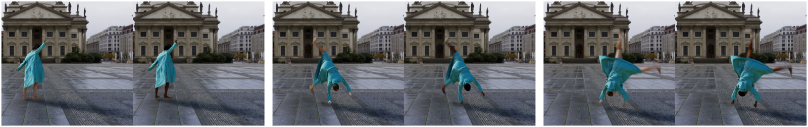
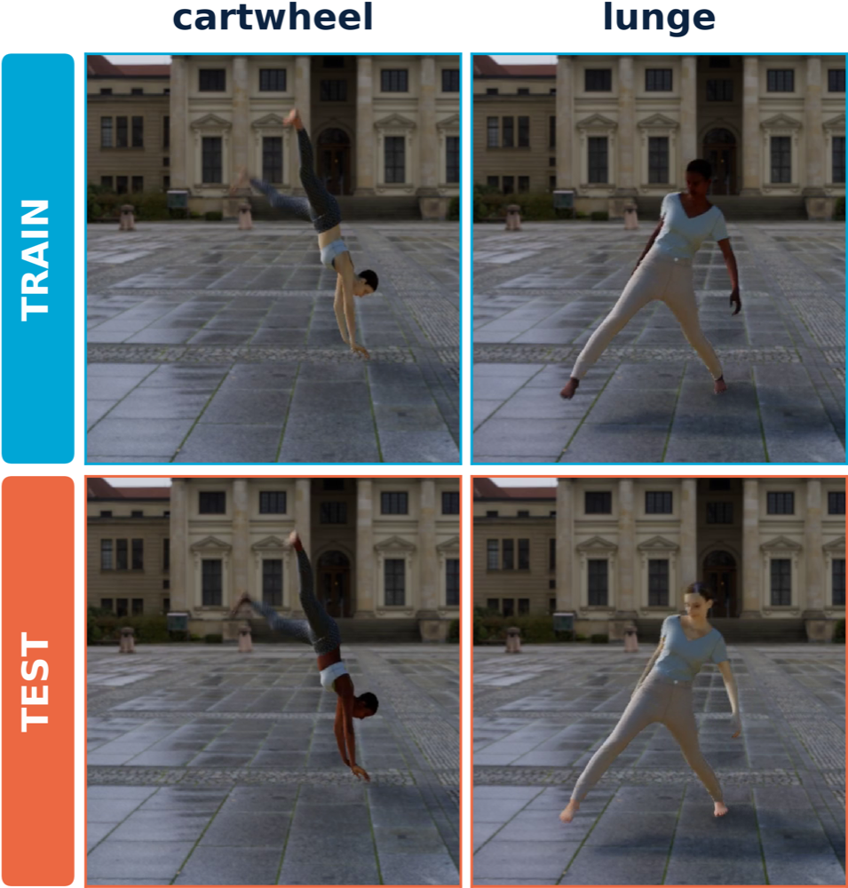
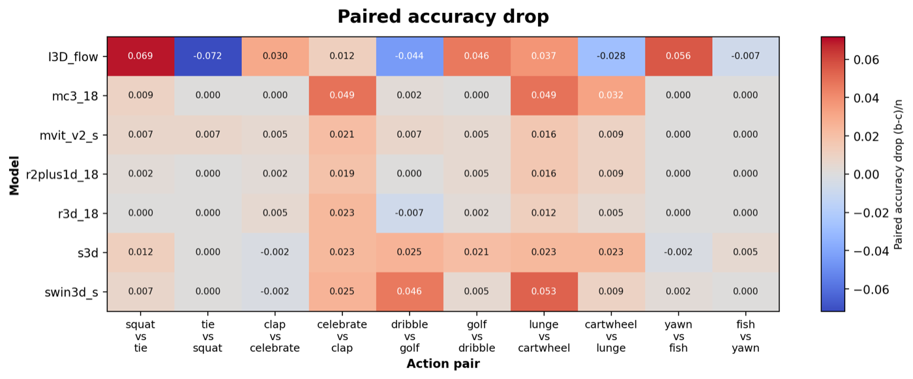
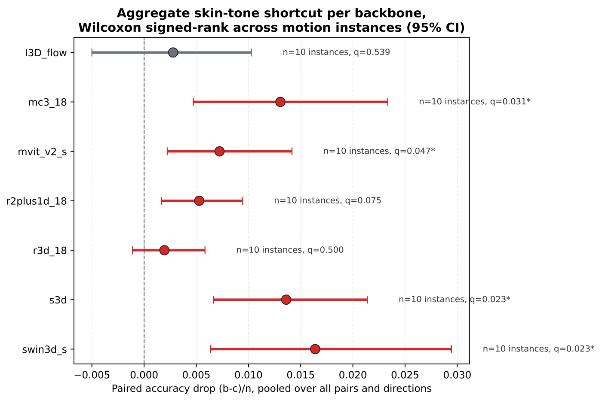
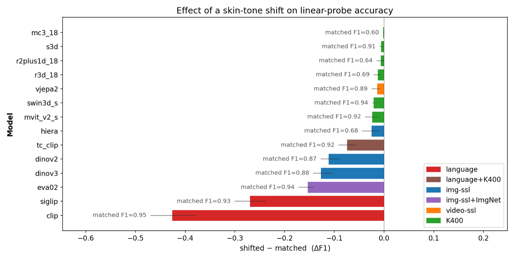
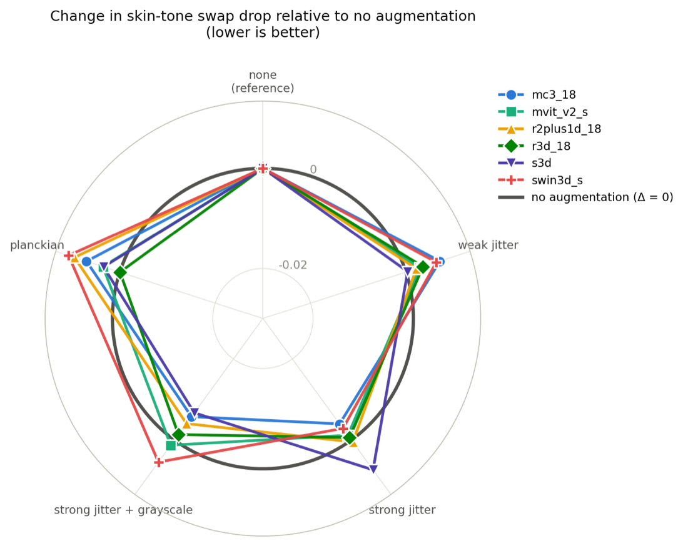

# ActionBiasBench

Code and reproduction commands for **"Controlled Auditing of Skin-Tone Shortcut
Sensitivity in Human Action Recognition"**.

<p align="center">
  
</p>
<p align="center"><em>Same actor, motion, clothing, background and camera. Only the skin
tone differs — and for some HAR models that is enough to change the predicted action.</em></p>

Recorded video confounds skin tone with performer, clothing, background and
recording conditions, so an observational gap cannot tell you whether a model is
*using* skin tone. This repository builds the controlled counterfactual instead:
synthetic clips that are byte-identical except for the skin texture, a training
split in which tone predicts the label perfectly, and a test split in which that
mapping is swapped.

## Results at a glance

Every number below is produced by the commands in [Experiments](#experiments);
the figures are copies of that output, checked in under `assets/readme/`.

### The test

<p align="center">
  
</p>

In training each action is only ever seen with one skin tone. At test the
tone–action mapping is swapped and nothing else changes, so a model that leaned
on tone has to lose accuracy. An optical-flow I3D, which cannot encode colour at
all, is the negative control.

**Scale.** 4,380 clips over 20 actions x 3 backgrounds x 7 tones. The audit uses
10 actions x 10 motion instances x 3 backgrounds x 4 tones = 1,200 clips, and
302,400 clip-level predictions.

### The shortcut is real but small

<p align="center">
  
  
</p>

Paired accuracy drop `(b-c)/n` after the swap, where `b` counts clips correct
under the matched tone and wrong under the shifted one and `c` the reverse. Four
of six RGB backbones drop significantly, but the largest effect is 1.6 pp:

| Model | Drop (pp) | 95% CI | q |
|---|---|---|---|
| I3D-flow *(control)* | 0.28 | [-0.50, 1.03] | 0.54 |
| R3D-18 | 0.19 | [-0.11, 0.58] | 0.50 |
| R(2+1)D-18 | 0.53 | [0.17, 0.94] | 0.075 |
| MViT-v2-S | 0.72 | [0.22, 1.42] | 0.047\* |
| MC3-18 | 1.31 | [0.47, 2.33] | 0.031\* |
| S3D | 1.36 | [0.67, 2.14] | 0.023\* |
| Swin3D-S | 1.64 | [0.64, 2.94] | 0.023\* |

5,000-resample cluster bootstrap over the 10 motion instances, Wilcoxon
signed-rank, Benjamini-Hochberg corrected. Positive = accuracy lost under the swap.

### Frozen features carry much more tone information

<p align="center">
  
</p>

Linear probes on frozen embeddings: CLIP loses 0.43 F1 and SigLIP 0.27 under the
same tone shift that costs a fine-tuned backbone under two points of accuracy.
Video-SSL (V-JEPA 2) loses almost nothing. A low matched F1 (MC3-18 at 0.60,
near chance for a binary task) means that probe never learned the task, so its
flat bar is not evidence of robustness.

### Colour augmentation is not the fix

<p align="center">
  
</p>

Radius = change in swap drop relative to no augmentation; outside the reference
circle means the augmentation made that model *more* tone-sensitive. No
condition — weak jitter, strong jitter, strong jitter + grayscale, or Planckian
illuminant jitter — helps every model, and none removes the need for curated
training data.

### What this does not show

The controlled result is a statement about **shortcut sensitivity**, not about
real-world demographic disparity. On real video the same six pretrained models
show no significant light- vs. other-tone accuracy gap (HMDB51: 0.67 vs 0.61,
p = 0.49 over 145 clips; Kinetics-400: 0.95 vs 0.95, p = 0.53 over 806 clips) —
and on HMDB51 the naive per-clip test *does* look significant (p = 8x10^-8) until
repeated clips of one performer are treated as a single unit. See
[Experiment 4](#4-real-world-observational-audit-section-4-pa-hmdb51--kinetics-dribbling).

## Layout

- `benchmarks/skin_tone/` — manifest generation, training-time analysis, significance testing
- `scripts/` — reproduction entry points (one per experiment, see below)
- `scripts/run_action_bias_bench.sh` — central launcher for the fine-tuning benchmark
- `data/`, `models/`, `utils/` — dataset/augmentation/model-loading library code
- `third_party/pytorch-i3d/`
- `poster/` — the ECCV poster (`landscape_poster.tex`), whose figures are built by
  `scripts/make_landscape_poster_figures.py`; see `llm_reports/landscape_poster.md`
- `assets/readme/` — the figures embedded above

All commands below are run from this directory (`ActionBiasBench/`) and are plain
Python — no cluster/SLURM setup required to reproduce a result.

## Setup

`tc_clip` (CLIP ViT-B/16 + temporal context, Kinetics-400 pretrained) is vendored via `models/huggingface_models.py::load_tc_clip/encode_tc_clip`, sourced from `appearance_free_cross_domain_action_recognition/tc-clip`. It needs its own environment (einops, mmcv-full, timm==0.4.12) separate from the other models.


You must supply external dataset/checkpoint locations explicitly. Required:

- `SKIN_TONE_DATASET_ROOT`: video-root for manifest generation
- `SKIN_TONE_FLOW_TVL1_ROOT_DIR`: TV-L1 flow root for the external flow I3D baseline

```bash
export SKIN_TONE_DATASET_ROOT=/data/skin_tone_actions/camera_far
export SKIN_TONE_FLOW_TVL1_ROOT_DIR=/data/skin_tone_actions/camera_far_flow_tvl1_fast_npz
bash scripts/run_action_bias_bench.sh --preflight
```

Generated manifests and label CSVs are written under `benchmarks/skin_tone/generated/`.

<details>
<summary>Full environment-variable reference (cross-validation, augmentation, jitter strength, ...)</summary>

- `SKIN_TONE_RGB_TORCHVISION_MODELS=r3d_18,mc3_18,mvit_v2_s` (or `all`)
- `SKIN_TONE_OUT_ROOT=/path/to/output_root`
- `SKIN_TONE_ACTION_PAIRS=squat:tie,clap:celebrate,...` (dark:light; default covers only
  the 5 base directions — set `SKIN_TONE_INCLUDE_REVERSED_PAIRS=1` to generate both
  directions of all 5 pairs in one run)
- `SKIN_TONE_COLOR_JITTER=0.8` (fraction of RGB-torchvision training clips jittered)
- `SKIN_TONE_COLOR_JITTER_BRIGHTNESS/CONTRAST/SATURATION/HUE` (jitter strength)
- `SKIN_TONE_COLOR_JITTER_CONSISTENT=1` (one jitter draw per clip, applied to every
  frame — **use this** for any jitter condition; without it, parameters are resampled
  independently per frame, producing unintended flicker on top of the intended color
  shift, see `data/rgb.py`)
- `SKIN_TONE_GRAYSCALE_PROB=0.2` (fraction of clips converted to grayscale;
  independent of `SKIN_TONE_COLOR_JITTER`, removes chroma entirely)
- `SKIN_TONE_PLANCKIAN_JITTER=0.8` (+ `_MIN_K`/`_MAX_K`/`_REFERENCE_K`, default
  3000/12000/6504K) — physically-motivated illuminant jitter, see [48] in the paper

**Cross-validation** (used for every number in the paper):

- `SKIN_TONE_SPLIT_MODE=cv` (vs. the older `original` fixed 6-train/4-held-out split;
  `run_action_bias_bench.sh` auto-appends `_cv` to `SKIN_TONE_OUT_ROOT` in this mode)
- `SKIN_TONE_CV_FOLDS=3`, `SKIN_TONE_CV_IDS=0,1,2,3,4,5,6,7,8,9` — 3-fold CV over the
  10 motion instances (cyclic blocks: fold0={0,1,2,3}, fold1={4,5,6,7}, fold2={8,9,0,1})
- `SKIN_TONE_SEEDS=0,1,2` — training seeds, layered on top of the CV folds (3 seeds
  for the main shortcut probe and frozen-feature probes; 2 seeds for the augmentation
  sweep, see Experiment 3)

</details>

---

## Experiments

Each subsection maps to one part of the paper, in the order results appear. A short
description of what it produces sits outside the fold; the runnable commands are
collapsed underneath.

### 0. Synthetic-vs-real domain gap (Section 3.1)

Quantifies how far the synthetic clips sit from real Kinetics-400 footage of the
matching action, using DINOv2 embeddings: `gap_ratio = d_cross(real, synth) /
d_real_intra(real, real)`. Paper reports a mean of ≈ 1.8 over the 10 actions.

<details>
<summary>Commands</summary>

```bash
python scripts/measure_synthetic_real_gap.py --n_real 50 --device cuda
```

Reuses the synthetic DINOv2 embeddings cached in Experiment 2; embeds and caches
real K400 clips on first run. Writes `out/bias_analysis/synthetic_real_domain_gap.csv`
(per-action `gap_ratio`) and prints the mean/median/range.
</details>

### 1. Biased fine-tuning stress test (Table 2, Figure 2 — Section 4.1)

The positive-control shortcut: skin tone is made predictive of a binary action label
during fine-tuning, then the model is evaluated with the tone assignment matched
(preserved) or shifted (reversed). Produces Table 2 and Figure 2.

<details>
<summary>Commands</summary>

**Manifest generation + training**, 6 RGB backbones + I3D-flow control, 3-fold CV × 3 seeds:

```bash
SKIN_TONE_OUT_ROOT=out/skin_tone_probe_v7 \
SKIN_TONE_SPLIT_MODE=cv \
SKIN_TONE_SEEDS=0,1,2 \
SKIN_TONE_MODALITIES=rgb_torchvision,flow_i3d_external \
SKIN_TONE_RGB_TORCHVISION_MODELS=mc3_18,mvit_v2_s,r2plus1d_18,r3d_18,s3d,swin3d_s \
SKIN_TONE_INCLUDE_REVERSED_PAIRS=1 \
bash scripts/run_action_bias_bench.sh
```

This drives `scripts/train_torchvision_rgb_probe.py` for the RGB backbones and
`benchmarks/skin_tone/train_skin_tone_pytorch_i3d_flow_probe.py` for the flow control.

**Aggregation, Figure 2 heatmap, and per-pair flip CSVs:**

```bash
python benchmarks/skin_tone/analyze_skin_tone_swap_influence.py \
  --root out/skin_tone_probe_v7_cv \
  --models all \
  --split_families seen,unseen \
  --out_dir out/skin_tone_probe_v7_cv_analysis
```

**Table 2 significance** — motion-instance-clustered Wilcoxon signed-rank test,
95% cluster-bootstrap CIs, and Benjamini–Hochberg correction (two separate families:
6 RGB backbones pooled at the model level, 4 tone-pairs within each backbone):

```bash
python benchmarks/skin_tone/summarize_skin_tone_significance.py \
  --root out/skin_tone_probe_v7_cv_analysis \
  --split_family unseen \
  --alpha 0.05
```

Reference-only script confirming exactly which files/columns feed Table 2 and that
the two BH families are disjoint (does not recompute anything):

```bash
python benchmarks/skin_tone/report_table2_correction_provenance.py \
  --analysis_root out/skin_tone_probe_v7_cv_analysis --split_family unseen
```

**Why celebrate/clap and lunge/cartwheel show the largest effect while yawn/fish is
flat** (Figure 2 discussion) — correlates each pair's pre-swap (matched) accuracy
against its swap effect, no new training runs:

```bash
python benchmarks/skin_tone/pair_difficulty_vs_shortcut.py \
  --root out/skin_tone_probe_v7_cv_analysis --split_family unseen
```
</details>

### 2. Frozen-feature probes + temporal self-similarity (Figures 3–4 — Section 4.2)

Trains a linear probe on frozen foundation-model features under the same biased
task, and compares it against a training-free temporal self-similarity diagnostic.
Produces Figures 3–4.

<details>
<summary>Commands</summary>

**1. Cache per-frame embeddings** (GPU; `tc_clip` needs its own environment, see above).
CLIP caches to `out/bias_analysis/clip_embeddings`, not the default
`out/bias_analysis/embeddings` — pass `--cache_dir` explicitly for CLIP everywhere
below, or downstream scripts silently load 0 clips for that model.

```bash
python scripts/skin_tone_bias_analysis.py --model <model> --frames 64
python scripts/skin_tone_bias_analysis.py --model clip --frames 64 --cache_dir out/bias_analysis/clip_embeddings
```

Models: `clip, siglip, dinov2, dinov3, eva02, hiera, hiera_large, vjepa2, tc_clip` +
the six RGB torchvision backbones.

**2. Linear probe**, 3-fold CV × 3 seeds:

```bash
python scripts/train_embedding_linear_probe.py --model <model> --seeds 0,1,2 --folds 0,1,2 \
  --cache_dir out/bias_analysis/embeddings \
  --out_root out/linear_probes/skin_tone_probe_<model>_linear_cv \
  --subsample_frames 64   # 0 for models whose native frame count is already ≤ 64
```

**3. Build the flat probe-drop summary** the plotting script reads:

```bash
python scripts/build_probe_summary.py --suffix _linear_cv --out out/linear_probes/_probe_summary_cv.json
```

**4. Temporal self-similarity (SSM/RSA) diagnostic** — no model/GPU needed, runs
entirely on the cached NPZ embeddings:

```bash
python scripts/ssm_frobenius_analysis.py --model <model> --metric rsa
python scripts/ssm_frobenius_analysis.py --model clip --metric rsa --cache_dir out/bias_analysis/clip_embeddings
```

**5. Regenerate Figures 3–4:**

```bash
PROBE_SUMMARY_PATH=out/linear_probes/_probe_summary_cv.json \
PROBE_OUT_PREFIX=out/linear_probes/_probe_cv \
python scripts/plot_probe_ssm.py
```

Writes `_probe_cv_drop_by_model.pdf` (Fig. 3), `_probe_cv_vs_ssm.pdf` (Fig. 4),
`_probe_cv_ssm_by_pair.pdf` (per-action-pair breakdown, supplementary).

**6. Why TC-CLIP's Figure 3 and Figure 4 positions disagree** (Section 4.2
discussion) — two diagnostics, both CPU-only, reusing the embeddings cached in
step 1 (≈20–30 min each, dominated by per-pair logistic-regression training):

```bash
# max-pool vs. mean-pool ablation: does mean-pooling cancel a sign-flipping
# tone signal across frames? (it doesn't -- TC-CLIP's drop got smaller under
# max-pooling, not larger)
python benchmarks/skin_tone/pooling_ablation_probe.py --models clip,tc_clip

# decision-direction alignment: for every same-clip tone swap, project the
# embedding shift onto the probe's own decision direction. This is what
# explains the disagreement -- TC-CLIP's tone-shift is *larger* in raw
# magnitude than CLIP's, but only ~4% of it lies along TC-CLIP's decision
# direction vs. ~14% for CLIP: the signal isn't weaker after fine-tuning, it
# just points somewhere the classifier isn't looking.
python benchmarks/skin_tone/probe_direction_alignment.py --models clip,tc_clip
```
</details>

### 3. Color-jitter / grayscale / Planckian mitigation (Figure 5, Supplementary — Section 4.3)

Four conditions, each retrained with the same 3-fold CV, 2 seeds (seeds beyond the
single original run were added specifically to address a single-seed reviewer
concern; the two seeds disagree on whether jitter helps, which is the paper's actual
finding here). Produces Figure 5.

<details>
<summary>Commands</summary>

| condition | jitter prob. | brightness/contrast/sat. | hue | grayscale | Planckian |
|---|---|---|---|---|---|
| weak jitter | 0.8 | ±0.2 | ±0.05 | — | — |
| strong jitter | 0.8 | ±0.8 | ±0.2 | — | — |
| strong jitter + grayscale | 0.8 | ±0.8 | ±0.2 | p=0.2 | — |
| planckian | — | — | — | — | p=0.8 |

```bash
SKIN_TONE_OUT_ROOT=out/skin_tone_probe_v7_cjstronggray \
SKIN_TONE_SPLIT_MODE=cv \
SKIN_TONE_SEEDS=0,1 \
SKIN_TONE_MODALITIES=rgb_torchvision \
SKIN_TONE_COLOR_JITTER=0.8 \
SKIN_TONE_COLOR_JITTER_BRIGHTNESS=0.8 SKIN_TONE_COLOR_JITTER_CONTRAST=0.8 \
SKIN_TONE_COLOR_JITTER_SATURATION=0.8 SKIN_TONE_COLOR_JITTER_HUE=0.2 \
SKIN_TONE_GRAYSCALE_PROB=0.2 \
SKIN_TONE_COLOR_JITTER_CONSISTENT=1 \
SKIN_TONE_INCLUDE_REVERSED_PAIRS=1 \
bash scripts/run_action_bias_bench.sh
# repeat with the other rows of the table above, one SKIN_TONE_OUT_ROOT per condition
```

Per-condition analysis (repeat Experiment 1's `analyze_skin_tone_swap_influence.py`
+ `summarize_skin_tone_significance.py` against each condition's own `..._cv` output
root), then the summary figure:

```bash
python scripts/plot_augmentation_radar.py \
  --roots "none=out/skin_tone_probe_v7_cv" \
          "weak jitter=out/skin_tone_probe_v7_cjweak_cv" \
          "strong jitter=out/skin_tone_probe_v7_cjstrong_cv" \
          "strong jitter + grayscale=out/skin_tone_probe_v7_cjstronggray_cv" \
          "planckian=out/skin_tone_probe_v7_planckian_cv" \
  --baseline none \
  --out_dir out/skin_tone_probe_v7_augmentation_conditions \
  --out_name augmentation_radar_delta
```

Writes `augmentation_radar_delta.{pdf,png}`: a baseline-anchored radar where every
model's no-augmentation level collapses onto one shared circle, so deviation from the
circle is the effect of that condition. Each `--roots` entry must cover the same
pair-tags across conditions, or the script silently restricts to the shared
(pair, seed) subset and prints the resulting unit count per model to the console.

The supplementary per-condition, per-pair, per-direction grid figure is produced by
the same `analyze_skin_tone_swap_influence.py` flip-breakdown output, run against
each condition's output root individually.
</details>

### 4. Real-world observational audit (Section 4, PA-HMDB51 + Kinetics dribbling)

Zero-shot (no fine-tuning) Kinetics-400-pretrained torchvision models, evaluated on
real video stratified by an existing/hand-assigned skin-tone label. Purely
observational — tone is confounded with performer, background, and recording
conditions here, which is exactly what motivates the synthetic audit; see each
script's docstring for the specific caveats.

<details>
<summary>Commands</summary>

**PA-HMDB51**, all classes with a clean Kinetics-400 counterpart:

```bash
python scripts/eval_pahmdb51_zero_shot.py --dry_run          # sanity-check class mapping first
python scripts/eval_pahmdb51_zero_shot.py                    # full run, all 6 models
```

**PA-HMDB51 "dribble" scaffold** (145 clips) — the source-video-dependence check
referenced in the abstract/conclusion. Reports the naive clip-level test alongside a
background-controlled test that treats repeated clips from the same source video as
one unit, since 145 clips resolve to only 29 distinct source videos:

```bash
python scripts/eval_dribble_scaffold.py --dry_run
python scripts/eval_dribble_scaffold.py
```

**Kinetics-400 "dribbling_basketball"** (806 clips, 806 distinct source videos — no
pseudo-replication correction needed, unlike the HMDB51 scaffold above; skin-tone
labels are hand-assigned from one representative frame per clip):

```bash
python scripts/eval_kinetics_dribble_zero_shot.py --dry_run
python scripts/eval_kinetics_dribble_zero_shot.py
```

**Supplementary: pooled McNemar re-analysis** of the zero-shot synthetic-audit
predictions, using the same clustering/BH machinery as the main paper instead of a
per-pair Bonferroni comparison:

```bash
python scripts/zero_shot_pooled_mcnemar.py --root <zero_shot_predictions_root> --alpha 0.05
```
</details>

---

## Notes on filenames

- `_cv` suffix on an output root or figure name means the 3-fold cross-validation
  protocol was used (every result in the paper); its absence means the older fixed
  6-train/4-held-out split.
- `out/skin_tone_probe_v7*` is the naming convention used throughout this README;
  don't reuse older `v5`/`v6` output-root defaults you may find elsewhere without
  overriding `SKIN_TONE_OUT_ROOT` — they predate the CV protocol and the current
  4-condition augmentation naming (`cjweak`/`cjstrong`/`cjstronggray`/`planckian`).
